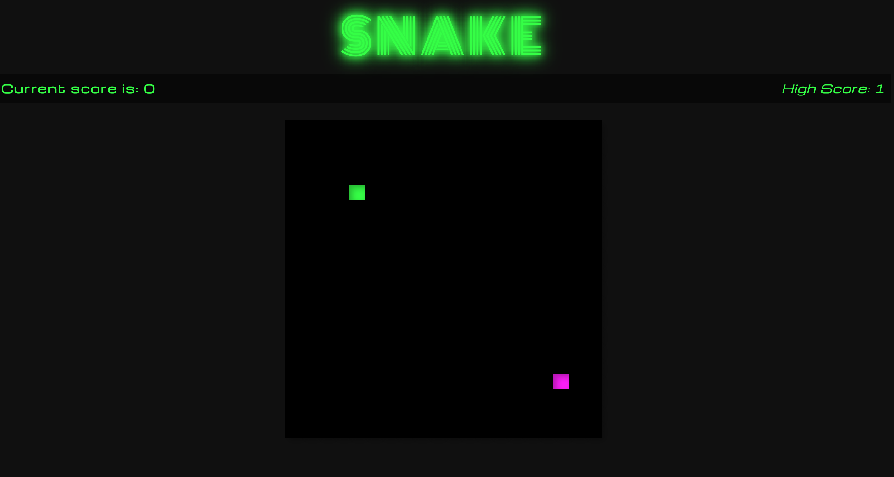

# snake_project


# Snake Game

## Description

The Snake Game is a classic arcade game where the player controls a snake that moves around the game board, eating food to grow while avoiding collisions with walls and its own body. This project implements the Snake Game using HTML, CSS, and JavaScript.

## Table of Contents

- [Deployment Link](#deployment-link)
- [Features](#features)
- [How to Play](#how-to-play)
- [Installation](#installation)
- [Timeframe & Working Team](#timeframe--working-team)
- [Technologies Used](#technologies-used)
- [Brief](#brief)
- [Planning](#planning)
  - [Initial Steps](#initial-steps)
  - [Sketches and Diagrams](#sketches-and-diagrams)
  - [Logic Flow](#logic-flow)
- [Build/Code Process](#buildcode-process)
  - [Setting Up the Game Board](#setting-up-the-game-board)
  - [Handling Snake Movement](#handling-snake-movement)
  - [Game Over Conditions](#game-over-conditions)
- [Challenges](#challenges)
  - [Technical Challenges](#technical-challenges)
    - [Managing Snake Movement](#1-managing-snake-movement)
    - [Game Over State Management](#2-game-over-state-management)
- [Key Learnings/Takeaways](#key-learningstakeaways)
- [Bugs](#bugs)
- [Future Improvements](#future-improvements)


## Deployment Link

[Play the Game](https://aishaa14.github.io/snake_project/snake.html)

## Features

- Classic Snake gameplay experience.
- High score tracking.
- Sound effects for interactions.

## How to Play

1. Use arrow keys to control the direction of the snake (up, down, left, right).
2. Guide the snake to eat the food that appears on the board.
3. As the snake eats, it grows longer.
4. Avoid running into the walls or the snake's own body.
5. Try to achieve the highest score possible before the game ends.

## Installation

Clone the repository to your local machine:

Open your terminal or command prompt and navigate to the directory where you want to store the game on your local machine. 
Then, use the following command to clone the repository: 

```
git clone https://github.com/AishaA14/snake_project.git
```
## Timeframe & Working Team

I worked independently on this project. I developed this Snake Game over the course of one week.

## Technologies Used

HTML
CSS
JavaScript

## Brief

This project was developed as part of my coding bootcamp curriculum. The objective was to create a classic Snake game using HTML, CSS, and JavaScript. The game allows a player to control a snake, guiding it to eat food and grow longer while avoiding collisions with the walls and itself.

## Planning

### Initial Steps

Before diving into the code, I took some time to plan out the Snake game project. This planning stage was crucial for understanding how the game would work, defining its logic, and ensuring a smooth development process.

### Sketches and Diagrams

I used Excalidraw, a collaborative whiteboard tool, to create visual sketches and diagrams that helped me visualize the game's components and interactions. These sketches allowed me to map out the following key aspects of the game:

- **Game Board:** I outlined the grid-based game board where the snake would move and grow. This included defining the dimensions and layout.

- **Snake Movement:** I planned how the snake's movement would be controlled using arrow keys and how it would grow longer as it consumed food.

- **Game Over Conditions:** I identified the conditions that would trigger a game over, such as collision with the board's edge or the snake itself.

- **Food Generation:** I thought about how and where food items would be randomly generated on the game board.

- **Scoring:** I considered how to keep track of the player's score as they successfully guided the snake to eat food.

### Logic Flow

I also created a flowchart to illustrate the logic flow of the game, including the game loop, player input handling, and win/lose conditions. This visual representation helped me ensure that I had a clear understanding of how all the game's components would come together.

[Excalidraw Diagram](excalidraw.png)

## Build/Code Process

### Setting Up the Game Board

To create the game board, I started by defining a grid using HTML and CSS. Here's an example of the code I used to set up the game board:

```html
<div id="game-board"></div>

```
```css
#game-board {
    /* Styles for the game board container */
    position: relative;
    top: 30px;
    outline: 2px solid #000;
}
```
This code creates a container for the game board and applies basic styling to position it on the page.

### Handling Snake Movement

Managing snake movement was a critical part of the game. I used JavaScript to handle arrow key input and update the snake's position accordingly. Here's a code snippet that shows how I handled snake movement:

```js
// Handle arrow key input
document.addEventListener("keydown", (e) => {
    if (gameState === "playing" && !gameOver) {
        if (e.key === "ArrowUp" && activeDirection !== "down") {
            activeDirection = "up";
        } else if (e.key === "ArrowDown" && activeDirection !== "up") {
            activeDirection = "down";
        } else if (e.key === "ArrowLeft" && activeDirection !== "right") {
            activeDirection = "left";
        } else if (e.key === "ArrowRight" && activeDirection !== "left") {
            activeDirection = "right";
        }
    }
});
```
This code listens for arrow key presses and updates the activeDirection variable based on the player's input.

### Game Over Conditions

Implementing game over conditions required careful consideration of collisions. Here's a code snippet illustrating how I handled game over conditions:

```js
// Check for collisions and game over
function moveSnake() {
    // ...
    if (selfCollision.length >= 1 || newBody[0] < 0 || newBody[0] > gridDimension[0] - 1 || newBody[1] < 0 || newBody[1] > gridDimension[1] - 1) {
        displayGameOverModal();
        // ...
    }
}
```
This code checks for collisions with the game board's edges and the snake itself, triggering a game over if any conditions are met.

These code snippets provide insights into the key components of the Snake game's codebase, from setting up the game board to handling movement and game over conditions. They represent some of the core logic that makes the game functional and enjoyable to play.

# Snake Game

## Challenges

### Technical Challenges

During the development of the Snake game, I encountered some technical challenges that tested my problem-solving skills and pushed me to learn and grow as a developer.

#### 1. Managing Snake Movement

**Challenge**: One of the early challenges was handling snake movement efficiently while preventing it from moving back into its own body. Implementing this logic in a grid-based system was more complex than I initially anticipated.

**Solution**: To address this challenge, I carefully reviewed the logic responsible for updating the snake's position. I implemented checks to ensure that the snake couldn't move directly into its own body by comparing its current direction with the intended direction. This required thorough debugging and testing to ensure smooth movement.

#### 2. Game Over State Management

**Challenge**: Managing the game over state posed a challenge. While the game displayed a "Game Over" modal, pressing an arrow key would cause the game to continue running in the background.

**Solution**: To address this issue, I had to implement a robust game state management system. I ensured that the game would respond to user input only when it was in the "playing" state. When the game was over, I disabled input to prevent unintended interactions. This required careful event handling and conditional checks to maintain the correct game state and ensure that the "Game Over" modal behaved as expected.

## Key Learnings/Takeaways

During the development of this Snake game project, I gained valuable insights and improved my skills in several key areas:

- **Game Development**: This project allowed me to delve into the world of game development, where I learned about game loops, collision detection, and rendering game elements in real-time. I now have a deeper understanding of how to create interactive and engaging user experiences.

- **JavaScript Proficiency**: Working on this project significantly enhanced my JavaScript skills. I gained proficiency in handling user input, managing game state, and optimizing code for smoother gameplay.

- **Problem Solving**: I encountered various challenges throughout the project, such as managing game over states and optimizing game logic. These challenges pushed me to think critically and develop effective problem-solving strategies. Debugging and profiling became essential skills in addressing issues and improving the game.

- **Project Management**: While I worked independently on this project, I learned the importance of project management and planning. I became more organized in setting goals, managing timelines, and breaking down tasks into manageable steps. This experience will be valuable in future collaborative projects.

- **User Experience (UX) Design**: Although this project focused primarily on game mechanics, I also considered the user experience. I learned to create intuitive game controls and provide feedback to the player through visual and audio cues.

These key learnings and takeaways have not only improved my technical skills but also shaped me into a more versatile and adaptive engineer. I look forward to applying these lessons in future projects and continuing to grow as a developer.

## Bugs

- **Pause Functionality**: There is a minor issue with the pause functionality. When the game is paused using the spacebar, the pause modal appears as expected. However, pressing the spacebar again does not resume the game. This behavior can be improved to allow players to easily pause and resume the game seamlessly.

## Future Improvements

While the current version of the game is functional, there are several exciting features and enhancements that could be added in the future to make it even more engaging and challenging:

- **Power-Ups and Boosts**: Implement power-up items that appear at random intervals on the game board. These power-ups could provide benefits like increased speed, temporary invincibility, or the ability to pass through walls.

- **Score Modifiers**: Introduce score modifiers such as "poison" items that, when consumed, decrease the player's score. This would add an extra layer of strategy and risk to the game.

- **Responsive Design**: Improve the game's responsiveness to make it playable and enjoyable on a wider range of devices, including mobile phones and tablets.

- **High Score Leaderboard**: Implement a high score leaderboard to encourage competition among players and provide a sense of achievement.

These future improvements would enhance the gameplay experience and make the game even more addictive and fun.


